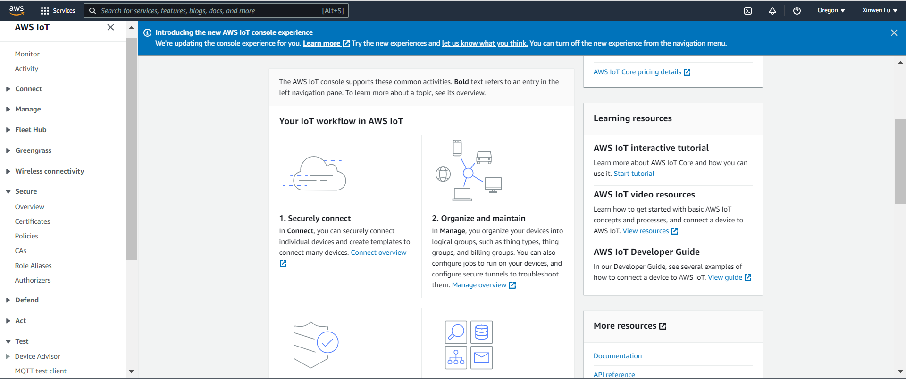

# AWS IoT MQTT Subscribe/Publish Project

This project shows an example of subcribing and publishing to AWS IoT via the MQTT protocol. It is the official PlatformIO AWS IoT example project.

## Download the project 
**Note**: By default, this project is already located in the ``` ~/esp/IoT-Examples/ ``` directory of the Ubuntu VM.
```
git clone --recurse-submodules https://github.com/xinwenfu/platformio-espidf-aws-iot.git
```


## Load the project into VS Code

Load the project into VS Code: *File* -> *Open Folder ...*

## Menuconfig

Run menuconfig to configure WiFi and AWS IoT end point via *ESP-IDF SDK Configuration Editor (menuconfig)* button at the bottom of the screen, or by typing ``` idf.py menuconfig ``` in a *ESP-IDF Terminal*. After the settings described below are configured, save and close the window. This is done by pressing *S* and then the ESC key if you used the *ESP-IDF Terminal* otherwise click save and close the window (tab). If we do not save the changes, they will not be reflected in the next build.
- *Example configuration*
  - *WiFi SSID*
  - *WiFi Password*
- *Component config*
  - *Amazon web services IoT Platofrm*
    - *AWS IoT Endpoint Hostname*

## Component Dependency
Install the jsmn component using the following command.

```
 idf.py add-dependency "espressif/jsmn^1.1.0"
```

## Create policy at AWS IoT console
An [AWS IoT policy](https://docs.aws.amazon.com/iot/latest/developerguide/iot-policies.html) configures what the device/thing will be allowed to do, e.g., *iot:Connect* (connecting to AWS IoT Core), *iot:Receive* (receiving a message from AWS IoT Core), *iot:Publish*  (publishing to a topic) and *iot:Subscribe* (subscribing to a topic)
1. Log into [AWS console](https://aws.amazon.com/console/)
2. Search the *IoT Core* service and open the AWS IoT console as follows



3. In the left navigation pane, configure by navigating through the following entries in order.
   - *Secure*
     - *Policies* -> *Create policy*
       - *Policy name*
       - *Policy document*. Use the following policy
```
{
  "Version": "2012-10-17",
  "Statement": [
    {
      "Effect": "Allow",
      "Action": [
        "iot:Connect",
        "iot:Receive",
        "iot:Publish",
        "iot:Subscribe"
      ],
      "Resource": "*"
    }
  ]
}
```
In the policy statement, 
- *Effect* allows or denies an action
- [*Action*](https://docs.aws.amazon.com/iot/latest/developerguide/iot-policy-actions.html) specifies a list of actions allowed or denied by the policy
- [*Resource*](https://docs.aws.amazon.com/iot/latest/developerguide/iot-action-resources.html) specifies the resource or resources on which the action is allowed or denied.
  - '*' is the wildcard character used in a policy which means all resources.

Here are some [publish/subscribe policy examples](https://docs.aws.amazon.com/iot/latest/developerguide/pub-sub-policy.html).

## Create certificate at AWS IoT console
Each thing will have a private key and certificate pair, which will be used for the client/thing authentication. In this project, we use the AWS IoT server to create the private key and certificate for the thing. 
1. (Optional if already in AWS IoT console) Log into AWS IoT console
2. (Optional if already using IoT Core) Search and use *IoT Core* service
3. In the left navigation pane, configure by navigating through the following entries in order.
   - *Security*
     - *Certificates* -> *Add certificate* -> *Create certificate*
       - *Certificate* -> *Auto-generate new certificate (recommended)*
       - *Certificate status* -> *Active*
         - *Download certificates and keys*. Download all certificates and keys. 
         - In particular, we need *Device certificate* and *Private key file*. The two files are text files and can be opened with any text editor.
       - Click the created certificate and attach the created policy

## Change device certificate and key file within VS code
When the project is loaded into VS Code, there are three files under the folder *src*->*certs*. 
1. *aws-root-ca.pem*. No need to change. The AWS root CA certificate can also be downloaded when the AWS IoT creates the certificate and private key for the thing. 
2. *certificate.pem.crt*. Click it and replace its content with the content of downloaded *Device certificate*
3. *private.pem.key*. Click it and replace its content with the content of downloaded *Private key file*

## Build, upload and serial monitor
Now build the project, and upload the firmware into ESP32. Use serial monitor to monitor the output from ESP32.

Within the IoT core console, click the Test -> MQTT test client. The project code publishes MQTT data to the topic *test_topic/esp32*. The MQTT test client can be used to publish and subscribe to *test_topic/esp32*.
